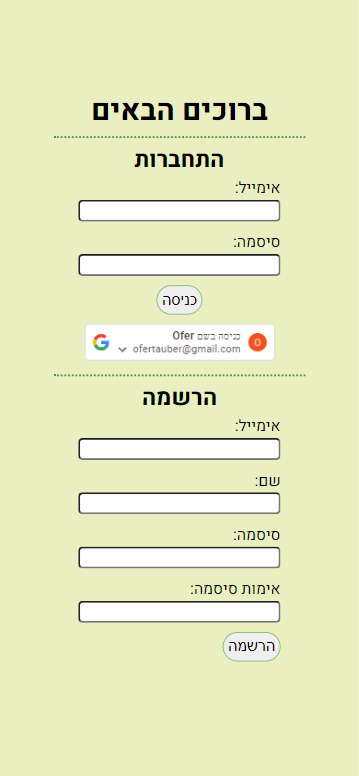
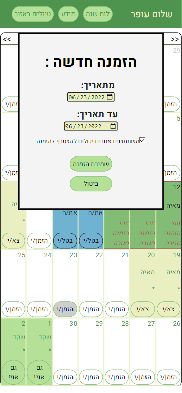

# :house_with_garden: Golan Highest House App :open_book:

React-based web-app for managing my family's holiday home in Katzrin

This is my mid-project (front-end only) of Fullstack Dev. Bootcamp - Appleseeds.

## Background:

I come from a large family - we are 10 cousins, most of us are married and some of us have children. Our parents decided to buy a holiday house together in Katzrin, which could be used by all of us.

Since none of us are live nearby - it is necessary to manage the house remotely - who is planning to come and visit? When? Does one of the family members want to hold an event for his friends, or is it a family vacation and the rest of the family is invited?

In addition - it is expected that significant and important information will be accumulated regarding the house - the password for WiFi, the amount and type of food left in the pantry, monitoring of technical faults and maintenance issues and the like.

## Description

The app allows each family member to create an account for identification.

Using the calendar feature - family members can see when the house is vacant and when it is occupied. You can indicate whether the guest intends to stay at home and others are invited to join or he invites his friends and asks that the rest of the family not join.

The "Information" page presents 3 sources:

- "Static" information (hard encoder) which is not expected to change frequently - Internet password, information on transportation, opening hours of the grocery store, home address and the like.
- Up-to-date list of the pantry - any user can edit it and it is updated immediately.
- Updated list of messages and alerts - any user can add to the list (for example - a light bulb burned, mail arrived, etc.)

The document folder in this repository includes my initial planning for building the
application -

##### [you can find the planning document here](./docs/Concept%20and%20design.docx)

#### The project implements a number of common functions in WEB development:

- All the dynamic records are stored in mockAPI - the application executes pet, post, put and delete requests using Axios.
- Switching pages is with React Route
- Identification of the user using Google Identity

### Technologies used by the application:

- HTML
- CSS
- JS
- React
- Identify users using "Google Identity"
- The dates are processed using JS torque

## Component's structure

## What next?

If you happen to take a look at my initial planning document (which you can
[find here](./docs/Concept%20and%20design.docx)) you must have noticed the pyramid chart which shows the features and capabilities I would like to implement in the most ideal situation.
This to-do list of dreams-to-fulfillment mainly includes:

- The "Updates and Notifications" section - Adding the delete and edit option
- Adding a "hiking-walking blog" with recommendations for trips in the area.
- Add GPS location to blog posts, and to the home-address.
- Pictures upload
- Password reset option
- Email alerts about your upcoming invitation, and attendees joining / canceling.

## Let's get in touch!

You are very welcome to contact me about the project - suggestions, questions, tips,
requests, and of course - information about job offers :wink:

- My mail: [ofertauber@gmail.com](mailto:ofertauber@gmail.com)
- My LinkedIn profile [https://www.linkedin.com/in/ofertauber/](https://www.linkedin.com/in/ofertauber/)

## Demo

[katzrin-house.netlify.app](https://katzrin-house.netlify.app)

## Screenshots

